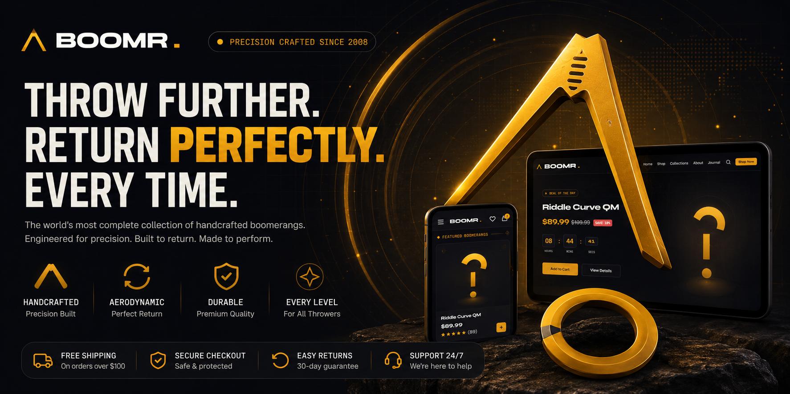

<h1>BOOMR.</h1>

<strong>A precision-crafted, fully interactive e-commerce experience for boomerang enthusiasts.</strong>

Built with pure HTML, CSS, and JavaScript. No frameworks, no dependencies, no build step.

  
  
  
  
  

---

## About

**BOOMR.** is a complete front-end e-commerce template for a fictional boomerang brand, built entirely with vanilla HTML, CSS, and JavaScript. It demonstrates a production-style online store with a full shopping flow: product catalog, search, wishlist, cart, multi-step checkout, and account modals, all running client-side with zero dependencies.

It's designed as a portfolio piece, learning resource, or starter template for anyone building a modern, animated e-commerce front end without a JavaScript framework.

## ✨ Features

- 🛒 **Shopping cart** with quantity controls, coupon codes, and live subtotal calculation
- ❤️ **Wishlist** with persistent badge counts
- 🔍 **Live product search** with category tag filters and instant results
- 🔐 **Sign in / create account modals** with social login UI and password visibility toggle
- 💳 **Multi-step checkout**: contact, shipping, payment, and order review
- ✅ **Order confirmation flow** with generated order numbers
- 🧭 **Dynamic product catalog** with filtering, sorting, and detailed product pages
- 🎨 **Custom cursor, scroll reveals, particle effects, and card glow** for a polished feel
- 📱 **Fully responsive** with a dedicated mobile navigation menu
- ♿ **Accessibility-minded** markup with ARIA roles, skip links, and focus-friendly modals

## 🛠️ Tech Stack

| Layer | Technology |
|---|---|
| Markup | Semantic HTML5 |
| Styling | Custom CSS3 (CSS variables, no preprocessor) |
| Logic | Vanilla JavaScript (ES6+) |
| Fonts | Google Fonts: Syne, Inter, Space Mono |

No npm install, no bundler, no framework. Just open it in a browser.
---
